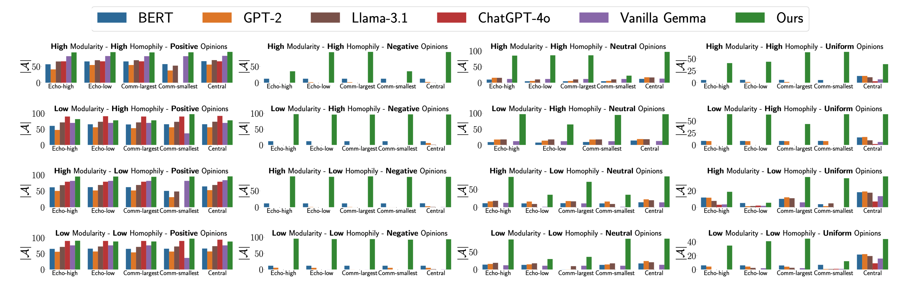
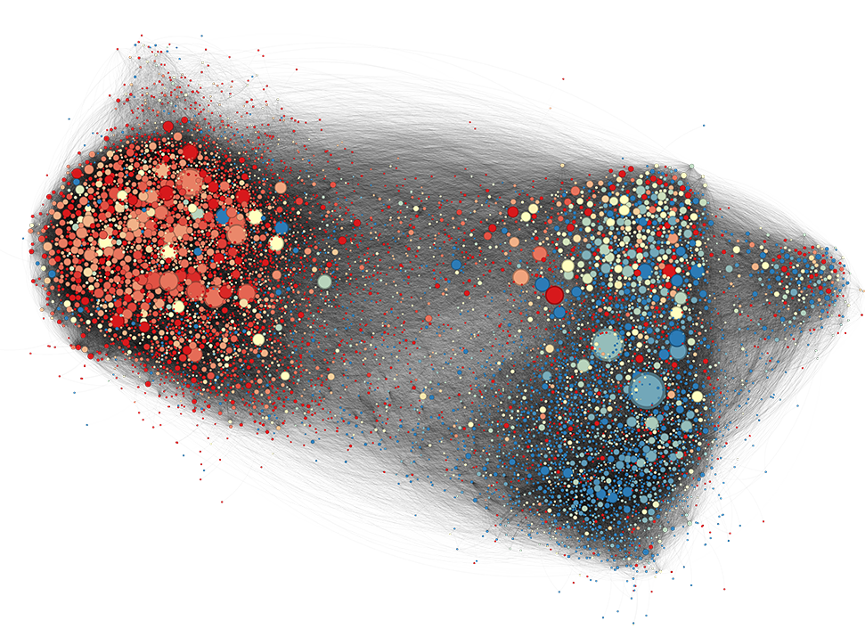
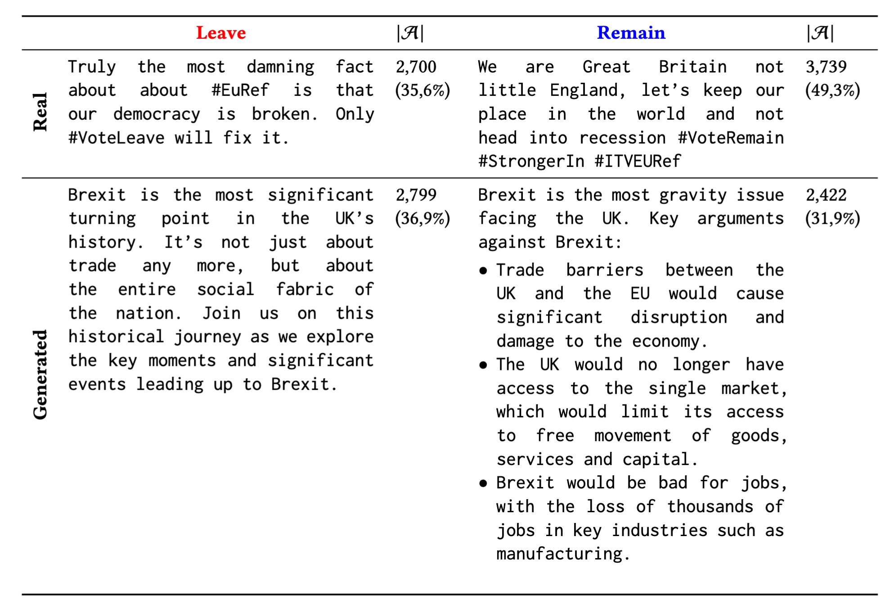

# Engagement-Driven Content Generation

## 🧠 Abstract

This repository supports the paper **_Engagement-Driven Content Generation with Large Language Models_** by Erica Coppolillo, Federico Cinus, Marco Minici, Francesco Bonchi, and Giuseppe Manco, accepted for publication at the Proceedings of the 31st ACM SIGKDD Conference on Knowledge Discovery and Data Mining (https://doi.org/10.1145/3711896.3736932). The paper presents a novel framework for training Large Language Models (LLMs) to generate content that maximizes user engagement on social networks. Our research tackles the challenge of moving beyond mere content coherence to strategically foster virality and interaction within simulated social environments.

---

## Cite us
If you use our code, please cite us:

```bibtex
@inproceedings{coppolillo2025engagement,
  title={Engagement-Driven Content Generation with Large Language Models},
  author={Coppolillo, Erica and Cinus, Federico and Minici, Marco and Bonchi, Francesco and Manco, Giuseppe},
  booktitle={Proceedings of the 31st ACM SIGKDD Conference on Knowledge Discovery and Data Mining (KDD '25)},
  year={2025},
  doi={10.1145/3711896.3736932}
}
```

---

## 🛠️ Approach

The core of the proposed methodology is a pipeline that leverages **Reinforcement Learning (RL)** to teach an LLM how to generate engaging content. The LLM acts as an **agent** whose **policy** (i.e., its strategy for generating text) is iteratively updated.

Here’s a more detailed look at the technical components:

1. **Query-Prompted Content Generation:** The process initiates when the LLM receives a **query `q`** (a specific topic or instruction). Based on this prompt, the LLM generates a piece of **content `t`**.

2. **Simulated Social Network Environment:** The generated content `t` is then "injected" into a simulated social network, represented as a **graph**. The LLM itself is considered a node within this graph.

3. **Engagement Simulation & Propagation Model:** Once injected, the content's spread and the resulting user engagement are simulated. This simulation is driven by an **engagement model**, which can be based on established theories from **opinion dynamics** (how opinions form and change in a population) and **information propagation** (how information disseminates through a network). A key feature is that the framework is designed to be **agnostic** to the specific engagement model used, allowing researchers to plug in different models to simulate various social phenomena.

4. **Reward Function**:

    The LLM agent receives a reward signal based on a composite function designed to encourage both engagement and quality. This reward considers:

   - **Virality/Engagement:** Quantified by the number of "active users" who interact with the content at the end of the propagation phase.
   - **Content Quality & Fluency:** Assessed using objective metrics. The paper mentions the **Flesch-Kincaid score** as a measure of readability, ensuring the content is understandable and well-formed. The system also aims to keep the content on-topic.

5. **Policy Update via RL:** The calculated reward is used to update the LLM's policy through an RL algorithm. This iterative feedback loop allows the LLM to learn which types of content, styles, or linguistic features lead to higher engagement and positive rewards for specific queries and network conditions. The learning procedure is adaptive to the opinion distribution of the network.

---

## 💡 Main Findings and Contributions

The study's findings underscore the potential of this approach:

- **Demonstrated Capability:** LLMs can be effectively trained to optimize content for social engagement within a simulated feedback loop.
- **Adaptive Learning:** The system demonstrates adaptability to the initial opinion distribution within the social network, meaning it can learn to tailor content effectively for different audience characteristics.
- **Model Agnosticism:** The framework's independence from any single engagement model enhances its versatility and applicability to diverse research questions in computational social science.
- **Implications:** This research paves the way for more sophisticated tools for studying online engagement, content strategies, and the impact of AI-generated text in social contexts. It also opens possibilities for creating more effective interventions or campaigns.

### 🧪 Benchmark: Engagement Across Models

The figure below compares engagement results (|𝒜|) across multiple language models on synthetic networks with different modularity, homophily, opinion distributions, and LLM positions.



Each subplot group corresponds to a unique network condition. Bars show the number of engaged users |𝒜| produced by different models, highlighting the performance of our fine-tuned approach.

---

## 🚀 Usage: Starting the RL process

Launch `src/synthetic_config_pipeline.sh` to run the experiments on the **synthetic** network. You can adjust the underlying user opinion, the LLM starting position, and the modularity and homophily of the network.

Launch `src/real_config_pipeline.sh` to run the experiments on the **real-world** data. You can specify "brexit" or "referendum" for processing the Brexit and Italian Referendum datasets, respectively, "positive" and "negative" for the network opinion distribution, and "low-centrality" or "high-centrality" for the LLM position in the graph.

### 📥 Example Input: Real-World Network (Brexit)

The figure below illustrates the real-world social graph used in our experiments on the Brexit dataset. Nodes represent users, and edges represent interactions. Node color indicates opinion polarity.



### 📤 Example Output: Generated Content Samples

Below is a table showing content generated by the LLM compared to real texts.



---

## 🔧 Requirements

Ensure you have the following packages installed:

```
conda env create -f environment_core.yml
conda activate socLLM
sh install_packages.sh
```
